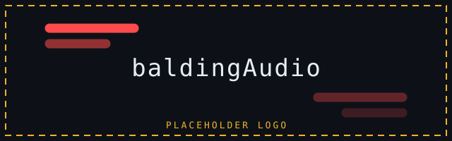

<p align="center">
  
</p>

<h1 align="center">baldingAudio</h1>

<p align="center">
  A visual sound-direction overlay for Windows, built for players who cannot rely on
  hearing where a sound came from.<br>
  Audio only. No game integration, no injection, nothing to detect.
</p>

<p align="center">
  <a href="docs/ANTI-CHEAT.md">Anti-cheat posture</a> ·
  <a href="docs/OPEN_PROBLEMS.md">Open problems</a> ·
  <a href="#what-it-actually-shows">What it shows</a> ·
  <a href="#build-and-run">Build and run</a>
</p>

---

## Why this exists

The user is **deaf in one ear**. In a competitive shooter that is not a mild
inconvenience: a footstep behind your right shoulder, or a grenade bouncing off a wall
to your left, produces a sound that is genuinely hard to place. So they cannot hear the
one cue that would tell them to turn.

This project turns *sound direction* into *something you see*, drawn at the edge of
your vision where you are already looking.

It is deliberately **not** a cheat and deliberately **not** an aimbot. It reads the
audio your machine is already playing and draws on top of the screen. See
[docs/ANTI-CHEAT.md](docs/ANTI-CHEAT.md) for the full reasoning — the short version is
that EA Javelin is a kernel anti-cheat, so the goal is not to hide, it is to be
genuinely uninteresting to it.

## What it actually shows

Bars run **inward from the left and right edges** of the screen. Nothing is ever drawn
from the top or bottom edges, and nothing is drawn near the centre — the middle of the
screen belongs to the game, including the minimap and the ammo counter.

**One edge at a time.** A bar is on the left *or* the right, never both:

```
```
  something to your left          nothing in front         something to your right  
┌────────────────────────┐   ┌────────────────────────┐   ┌────────────────────────┐
│                        │   │                        │   │                        │
│──────                  │   │                        │   │                  ──────│
│                        │   │      ( nothing )       │   │                        │
│────                    │   │                        │   │                    ────│
│                        │   │                        │   │               ─────────│
│                        │   │                        │   │                        │
└────────────────────────┘   └────────────────────────┘   └────────────────────────┘
        left edge                   left + right                  right edge        
```

- **Which edge** — the side the sound is on, and only that side.
- **Height** — front at the top, directly to the side in the middle, behind at the
  bottom. Closer to the top means more in front of you.
- **Length** — see below.
- **Brightness** — how loud.
- **Nothing is drawn when nothing is sounding.** A permanent overlay is noise.

### On a stereo headset, the bar is the difference between your ears

This is the part worth understanding before you judge the display, because it is a
real limitation rather than a missing feature.

With two channels, the only direction you can measure reliably is **how much louder one
ear is than the other**. Front-versus-back is genuinely ambiguous from a stereo mix —
there is no public Windows API that reports it, and no honest estimator can invent it.

So on stereo:

- The bar means **"off to one side, and this is how far off"**.
- A sound **dead ahead, or directly behind, draws nothing at all**, because it has no
  left/right difference. That is not a bug; it is what the measurement says. A grenade
  in your face is invisible, by design.
- A sound to your right draws only on the right, and how long the bar is grows with how
  lopsided it is.
- Anything below **3 dB between the ears** is treated as centred and ignored, because
  that is roughly where a level difference becomes reliably localisable, and anything
  under about 1 dB is below the noise of a quiet room. Measured on the running app, a
  1 dB and a 2 dB pan both draw nothing, 3 dB and up draw once, always on the correct
  side. The threshold is one number in `config.json` — `balanceFloorDb` — and it is
  measured in decibels because "0.33" is not something anyone can judge by ear.

Loudness did not disappear — it moved to **brightness**, so length and brightness answer
two different questions and neither is wasted.

The balance is measured **per frequency band**, not across the whole mix. This matters:
your app can only measure the entire mix, so loud centred music plus a quiet footstep to
the right averages out to nothing and the footstep vanishes. Scoring each band by its
energy times how lopsided it is pulls the footstep out of the music. In the test suite
this is the difference between measuring `0.042` (nothing drawn) and `1.00` (full bar).

### On 7.1 or more, the old model still applies

Each speaker has a real, known position, so the sign of the bearing is a genuine
measurement and **length means loudness** as before. The two display models are chosen
automatically from the channel count of your output device.

If your device is stuck at stereo, a 7.1-capable headset or a virtual 7.1 device (like
what Steam, OBS, or Windows themselves can install) will give you real positional
information — the front/back axis included — with no other change.

## How it works

Two projects, and the split is load-bearing:

| Project | Target | Contains |
| --- | --- | --- |
| `BaldingAudio.Core` | `net8.0`, **no Windows reference at all** | DSP, direction estimation, overlay layout, software rasteriser |
| `BaldingAudio.App` | `net8.0-windows`, WinForms | WASAPI loopback capture, layered topmost window, hotkeys |

Core builds and tests on Linux, which is how this is developed and tested without a
game. The only things that touch Win32 are loopback capture, one layered window, and a
`RegisterHotKey` window.

- **Capture thread** reads WASAPI packets, runs the analyser inline, publishes a
  direction spectrum.
- **UI thread** owns the overlay window, drives the line tracker, and draws.

Analysis runs on the capture thread so a burst of audio can never delay drawing, and
drawing runs on the UI thread because `UpdateLayeredWindow` belongs to the thread that
created the window. The spectrum is double-buffered across the seam.

## Build and run

Requires the .NET 8 SDK. **Windows is required to run it**; it builds anywhere.

```bash
# from a WSL2 checkout, or with dotnet on PATH on Windows
dotnet publish src/BaldingAudio.App/BaldingAudio.App.csproj \
  -c Release -r win-x64 --self-contained true -o artifacts/win-x64
```

The output is self-contained — no .NET install needed on the target machine.

```bash
artifacts/win-x64/baldingAudio.exe
```

### Verify it works, without a game

```bash
artifacts/win-x64/baldingAudio.exe --selftest
```

Runs 33 checks — the DSP, the display model, the Win32 interop constants, and the
capture-to-UI handoff — and exits. All of them run headless, including on Linux, and the
interop group needs no audio device. This is the fastest way to know a build is sane.

Two display flags, for looking at geometry only. **Both bypass the audio pipeline
entirely** and inject cues directly, so they will not tell you anything about whether
the overlay *reacts*:

```bash
baldingAudio.exe --demo         # scripted cues, no audio needed
baldingAudio.exe --demo-flood   # every cue parked on screen at once
```

To check that it reacts, run with no flag and play something.

## Controls

All four are `Ctrl+Alt+Shift` plus a key (`B` pause, `P` preset, `D` diagnostics,
`Q` quit), chosen so they cannot collide with a game binding or fire accidentally
mid-fight. A pause **freezes** the overlay rather than clearing it, so a paused overlay
is visibly still there rather than looking like a crash.

## Configuration

`%APPDATA%\baldingAudio\config.json`, created on first run. Both of the knobs that
matter most are live and need no rebuild:

- `tuning.displayFloorDb` — quietest sound drawn, in dBFS. Lower shows more.
- `style.balanceFloor` — smallest left/right imbalance drawn, `0`–`1`. Raise it to cut
  clutter further, at the cost of missing sounds only slightly off to one side.

The same directory holds `baldingAudio.log`, which reports what the analyser is
actually measuring each second. If the display is doing something surprising, the log
is the first place to look — it distinguishes "measured nothing" from "drew nothing".

## Contributing

The test suite is `--selftest`, not xunit. It lives in
`src/BaldingAudio.Core/Diagnostics/` and in `src/BaldingAudio.App/`, and it is the
primary way to check a change.

**Please read [AGENTS.md](AGENTS.md) before contributing.** It records the hard
constraints, the display model, the rejected designs, and a list of things that were
learned the hard way. Two rules in particular:

1. **The anti-cheat constraint outranks everything.** No kernel driver, no DLL
   injection, no reading another process's memory, no synthetic input, no hooking, no
   obfuscation. See [docs/ANTI-CHEAT.md](docs/ANTI-CHEAT.md).
2. **A check that cannot fail is worse than no check.** Every fix in this repository was
   verified by reverting it and watching the check go red, and that caught several real
   bugs that would otherwise have shipped. If you add a check, break the thing on
   purpose and confirm it notices.

## Status

Actively developed, not a finished product. Known limitations and the reasoning behind
the open problems are in [docs/OPEN_PROBLEMS.md](docs/OPEN_PROBLEMS.md) — including
the honest list of things that were diagnosed wrongly.

## License

Not yet chosen. Add a `LICENSE` file before the first public release.

---

<p align="center"><sub>
Placeholder logo. A real one is coming with the first release.
</sub></p>
